# RAG Evaluation Pipeline

End-to-end map of every CLI command — required inputs, config keys, and output files.

---

## Process Flow

```mermaid
flowchart TD

  %% ─────────────────────────────────────────────
  %% SOURCE DATA
  %% ─────────────────────────────────────────────
  PDFS[/"📄 Financial PDFs\n(local only — not committed)"/]
  EXAMPLES[/"📋 data/processed/financebench/examples.jsonl\nquestion_id · question · gold_answer · evidence[]"/]

  %% ─────────────────────────────────────────────
  %% STAGE 0 — build-index
  %% ─────────────────────────────────────────────
  subgraph S0["Stage 0 — build-index"]
    EXTRACT["extract-pages\nPDF → page text"]
    BUILD["build-index\nConfigs:\n  configs/retrieval/recursive_text_800.yaml\n  configs/embedding/ollama_nomic.yaml\nChunks pages → embeds → builds FAISS index"]
  end

  PDFS --> EXTRACT
  EXTRACT --> PAGES[/"pages.jsonl\ndoc_name · page_num · text"/]
  PAGES --> BUILD
  BUILD --> INDEX[/"data/indexes/financebench/\n├ index.faiss\n├ metadata.pkl\n└ chunk_store.json\n  (chunk text + doc_name + page_num)"/]

  %% ─────────────────────────────────────────────
  %% STAGE 1 — retrieve
  %% ─────────────────────────────────────────────
  subgraph S1["Stage 1 — retrieve"]
    RETRIEVE["retrieve\nDense ANN search: question → top-k chunks\nConfig: configs/retrieval.yaml\n(top_k · embedding model · run_id)"]
  end

  INDEX --> RETRIEVE
  EXAMPLES --> RETRIEVE
  RETRIEVE --> RET_RESULTS[/"runs/run_NNN/retrieval_results.jsonl\nquestion_id\nretrieved[]:\n  rank · chunk_id · doc_name\n  page_num · text · score"/]

  %% ─────────────────────────────────────────────
  %% STAGE 2 — eval-retrieval
  %% ─────────────────────────────────────────────
  subgraph S2["Stage 2 — eval-retrieval"]
    EVAL_RET["eval-retrieval\n--run-id run_NNN\nScores retrieved chunks vs gold evidence:\nhit@k  ·  evidence text overlap\nrank of first gold page hit"]
  end

  RET_RESULTS --> EVAL_RET
  EXAMPLES --> EVAL_RET

  EVAL_RET --> RET_SCORES[/"runs/run_NNN/retrieval_scores.jsonl\nquestion_id · doc_hit@k · page_hit@k\nevidence_text_hit@k · best_evidence_overlap\npage_first_hit_rank · failure_labels[]"/]
  EVAL_RET --> RET_SUMMARY[/"runs/run_NNN/retrieval_summary.json\nhit rates by k · rank percentiles\nfailure label counts"/]
  EVAL_RET --> RET_REPORT[/"reports/retrieval_eval_run_NNN.md\nHuman-readable retrieval quality report"/]

  %% ─────────────────────────────────────────────
  %% STAGE 3 — run-rag
  %% ─────────────────────────────────────────────
  subgraph S3["Stage 3 — run-rag"]
    RUN_RAG["run-rag\nConfig: configs/evaluation/rag_dense_local.yaml\n───────────────────────────────────\nrag_eval.examples_path\nrag_eval.retrieval_results_path\nrag_eval.mode:\n  rag_dense      top-k retrieved chunks\n  rag_oracle     gold evidence text\n  rag_no_context question only\nrag_eval.top_k  (default 5)\nrag_eval.max_context_chars  (default 4000)\nmodel.provider / model_name\njudge.enabled  (optional inline judge)\n───────────────────────────────────\nFormats context → calls generation LLM\nComputes lexical scores per prediction"]
  end

  RET_RESULTS --> RUN_RAG
  EXAMPLES --> RUN_RAG

  RUN_RAG --> RAG_PREDS[/"runs/TIMESTAMP/rag_predictions.jsonl\nquestion_id · question · gold_answer\nprediction · mode · model_name\nprompt_id · prompt_version · top_k\ncontext_chunk_ids[] · latency_ms\ninput_tokens · output_tokens\nstatus · error"/]

  RUN_RAG --> RAG_SCORES_V1[/"runs/TIMESTAMP/scores.jsonl\nquestion_id\nscores{exact_match, normalized_string_match,\n       numeric_match, unit_match}\njudge{verdict, reason, numeric_error,\n      unsupported_claims}  (if judge enabled)\nstatus"/]

  RUN_RAG --> RAG_META[/"runs/TIMESTAMP/rag_run_metadata.json\nrun_id · model · top_k · mode\nretrieval_run_id · score_summary{}\njudge_summary{} · duration_ms"/]

  RUN_RAG --> RAG_CFG[/"runs/TIMESTAMP/config.yaml\nFull config snapshot (reproducibility)"/]

  %% ─────────────────────────────────────────────
  %% STAGE 4 — score-rag
  %% ─────────────────────────────────────────────
  subgraph S4["Stage 4 — score-rag  (re-score without re-generating)"]
    SCORE_RAG["score-rag\nConfig: configs/evaluation/rag_score_local.yaml\n───────────────────────────────────\nrag_score.run_dir  (TIMESTAMP dir)\nrag_score.retrieval_results_path  (optional)\nrag_score.k  (default 5)\nanswer_judge:\n  prompt: prompts/judges/answer_correctness_v2.txt\ngrounding_judge:\n  prompt: prompts/judges/answer_grounding_v1.txt\n───────────────────────────────────\nCalls TWO judge LLMs per question\n(independent of generation LLM)\nAssigns failure labels + category per row"]
  end

  RAG_PREDS --> SCORE_RAG
  RET_RESULTS --"optional: grounding context\n(enables grounding judge)"--> SCORE_RAG

  SCORE_RAG --> ANS_SCORES[/"rag_answer_scores.jsonl\nquestion_id · gold_answer · prediction\nexact_match · normalized_string_match\nnumeric_match · unit_match\ngold_numeric_values[]\nanswer_verdict:\n  correct | partially_correct\n  incorrect | not_answered\nanswer_reason · answer_numeric_error\nanswer_unsupported_claims\nanswer_judge_status"/]

  SCORE_RAG --> GRD_SCORES[/"rag_grounding_scores.jsonl\nquestion_id\ngrounding_verdict:\n  grounded | partially_grounded | ungrounded\ncitation_correct · unsupported_claims\ngrounding_reason · grounding_judge_status"/]

  SCORE_RAG --> COMB_SCORES[/"rag_combined_scores.jsonl\nAll answer + grounding fields merged\nfailure_labels[]:\n  numeric_error    wrong number / scale\n  unsupported_claim  assertion not in evidence\n  ungrounded       answer not traceable to chunks\n  over_refusal     model said 'I don't know'\n  reasoning_error  incorrect with no other label\ncategory:\n  answer_correct_grounded\n  answer_correct_ungrounded\n  answer_wrong_grounded\n  answer_wrong_ungrounded\n  answer_correct | answer_wrong  (no grounding)"/]

  %% ─────────────────────────────────────────────
  %% STAGE 5 — join-metrics
  %% ─────────────────────────────────────────────
  subgraph S5["Stage 5 — join-metrics"]
    JOIN["join-metrics\n--retrieval-scores  runs/run_NNN/retrieval_scores.jsonl\n--answer-scores     runs/TIMESTAMP/rag_combined_scores.jsonl\n--output-dir        runs/TIMESTAMP/joined\n--k  5\n───────────────────────────────────\nJoins retrieval hit signal with answer correctness\nper question_id → 2×2 correlation matrix"]
  end

  RET_SCORES --> JOIN
  COMB_SCORES --> JOIN

  JOIN --> JOINED_METRICS[/"joined/joined_metrics.jsonl\nquestion_id\nretrieval{\n  doc_hit@k · page_hit@k\n  evidence_text_hit@k\n  best_evidence_overlap\n  page_first_hit_rank\n}\nanswer{\n  exact_match · numeric_match\n  unit_match · gold_numeric_values[]\n}\njudge_verdict · judge_numeric_error\njudge_unsupported_claims\ncategory:\n  retrieval_hit_answer_correct\n  retrieval_hit_answer_wrong\n  retrieval_miss_answer_correct\n  retrieval_miss_answer_wrong\nfailure_labels[]"/]

  JOIN --> JOINED_SUMMARY[/"joined/joined_summary.json\nexample_count\nretrieval_hit_answer_correct  (count)\nretrieval_hit_answer_wrong    (count)\nretrieval_miss_answer_correct (count)\nretrieval_miss_answer_wrong   (count)\nretrieval_hit_count\nanswer_correct_count\nnumeric_error_count\nunsupported_claim_count\nover_refusal_count\nreasoning_error_count\nno_failure_label_count"/]

  %% ─────────────────────────────────────────────
  %% STAGE 6 — report-rag
  %% ─────────────────────────────────────────────
  subgraph S6["Stage 6 — report-rag"]
    REPORT["report-rag\n--joined-dir        runs/TIMESTAMP/joined  (required)\n--rag-run-dir       runs/TIMESTAMP         (optional)\n--retrieval-summary runs/run_NNN/retrieval_summary.json  (optional)\n--run-id            TIMESTAMP\n--output-dir        reports/\n───────────────────────────────────\nRenders Markdown report with tables,\nstatistics, and representative examples"]
  end

  JOINED_METRICS --> REPORT
  JOINED_SUMMARY --> REPORT
  RAG_META --"optional: model metadata"--> REPORT
  RAG_PREDS --"optional: example Q&A text"--> REPORT
  RET_SUMMARY --"optional: retrieval hit rates"--> REPORT

  REPORT --> MD_REPORT[/"reports/rag_eval_TIMESTAMP.md\n• Run metadata  (model · top_k · mode)\n• Answer accuracy table\n    correct / partially_correct\n    incorrect / not_answered\n• Retrieval hit rates by k\n• 2×2 correlation matrix\n    retrieval hit/miss × answer correct/wrong\n• Failure label breakdown + rates\n• Best examples  (retrieval_hit_answer_correct)\n• Worst examples (retrieval_hit_answer_wrong\n                  + retrieval_miss_answer_wrong)"/]

  %% ─────────────────────────────────────────────
  %% DIAGNOSTIC — inspect-rag  (any time after Stage 3)
  %% ─────────────────────────────────────────────
  subgraph S7["Diagnostic — inspect-rag  (any time after Stage 3)"]
    INSPECT["inspect-rag\n--run           runs/TIMESTAMP\n--question-id   FB-001\n--retrieval-run runs/run_NNN   (optional)\n--joined-dir    runs/TIMESTAMP/joined  (optional)\n───────────────────────────────────\nSingle-question deep-dive; prints to stdout"]
  end

  RAG_PREDS --> INSPECT
  RAG_SCORES_V1 --> INSPECT
  RET_RESULTS --"optional: chunk text"--> INSPECT
  RET_SCORES --"optional: overlap metrics"--> INSPECT
  JOINED_METRICS --"optional: failure labels"--> INSPECT

  INSPECT --> STDOUT[/"stdout — per-question inspection\n• Question · Gold answer · Prediction\n• Answer judge verdict + numeric_error flag\n• Failure labels + category\n• Gold evidence location  (doc · page)\n• Retrieved chunks with ✓/✗ hit markers\n• Text preview + similarity score per chunk\n• Chunk IDs fed to the model"/]
```



---

## Run Commands (M5 local, Ollama)

```bash
# Stages 0-2 are one-time setup (build index, retrieve, eval retrieval).
# Skip if runs/run_NNN/retrieval_results.jsonl already exists.

# Stage 3 — generate answers
python -m financebench_eval run-rag \
  --config configs/evaluation/rag_dense_local.yaml

# Stage 4 — score with judges (re-runnable without re-generating)
python -m financebench_eval score-rag \
  --config configs/evaluation/rag_score_local.yaml \
  --run-dir runs/TIMESTAMP

# Stage 5 — join retrieval + answer metrics
python -m financebench_eval join-metrics \
  --retrieval-scores runs/run_NNN/retrieval_scores.jsonl \
  --answer-scores    runs/TIMESTAMP/rag_combined_scores.jsonl \
  --output-dir       runs/TIMESTAMP/joined \
  --k 5

# Stage 6 — generate Markdown report
python -m financebench_eval report-rag \
  --joined-dir        runs/TIMESTAMP/joined \
  --rag-run-dir       runs/TIMESTAMP \
  --retrieval-summary runs/run_NNN/retrieval_summary.json \
  --run-id            TIMESTAMP

# Diagnostic (any time after Stage 3)
python -m financebench_eval inspect-rag \
  --run           runs/TIMESTAMP \
  --question-id   FB-001 \
  --retrieval-run runs/run_NNN \
  --joined-dir    runs/TIMESTAMP/joined
```

---

## Key Design Decisions

| Decision | Reason |
|---|---|
| `score-rag` is separate from `run-rag` | Re-scoring with different judges doesn't require re-running the expensive generation LLM |
| Two judges (answer + grounding) | Orthogonal signals — a model can be correct but ungrounded (lucky hallucination) or grounded but wrong (faithfully cited bad context) |
| `numeric_error` suppressed when `over_refusal` | Refusals have no numeric error to diagnose; co-labeling is noise |
| `join-metrics` required before `report-rag` | Decouples correlation analysis from report rendering; allows re-reporting at different k values |
| `retrieval_results_path` optional in `score-rag` | Grounding judge skips gracefully when no retrieval context is provided |
